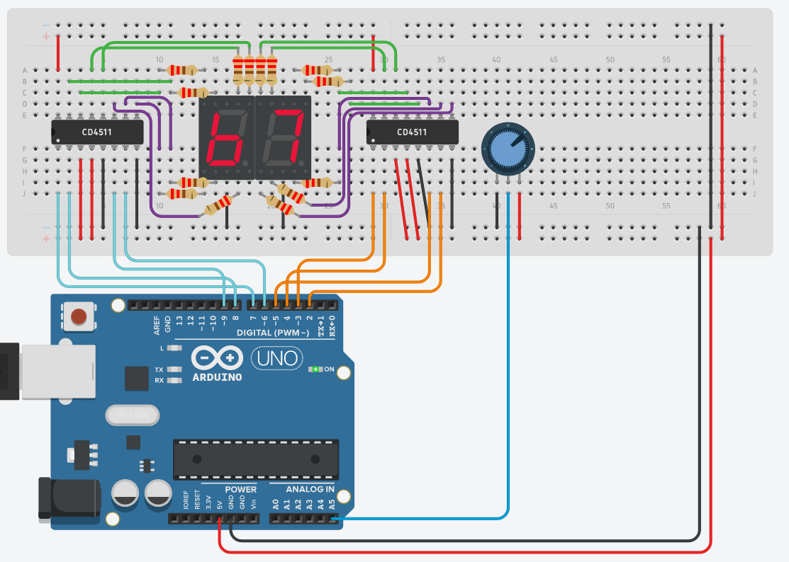
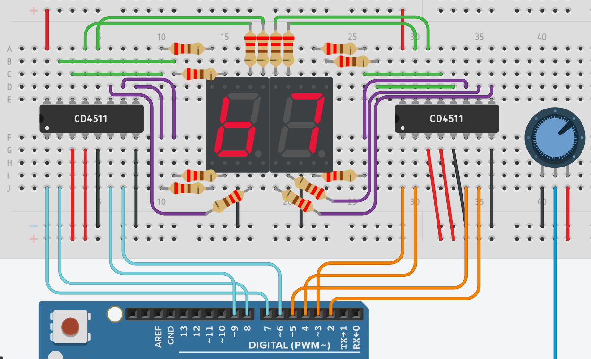

# R3-SoftwareTask1-DanielSu

 https://www.tinkercad.com/things/hkJnB3SZcm3 

## Full diagram:

## How it works:

1. Input from the potentiometer is read through the A5 analog input pin

2. The input is converted to a range from 0-99 and separated into the tens and ones digits

3. The digits are converted to binary and sent out through the digital pins 2-9

4. Pins 2-5 are connected to the decoder for the ones digit display, and pins 6-9 are connected to the decoder for the tens digit

5. The output pins on the decoders are connected to the proper inputs on the two displays with 220 Ω resistors

